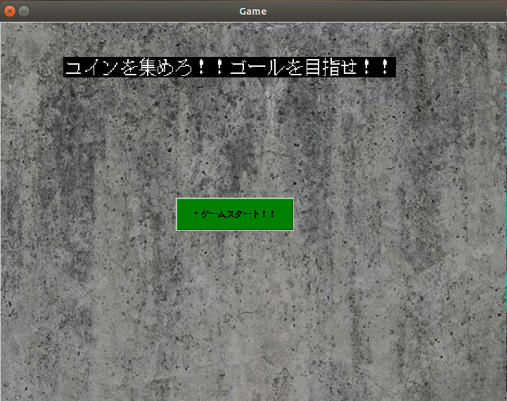
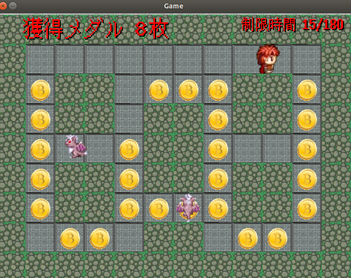
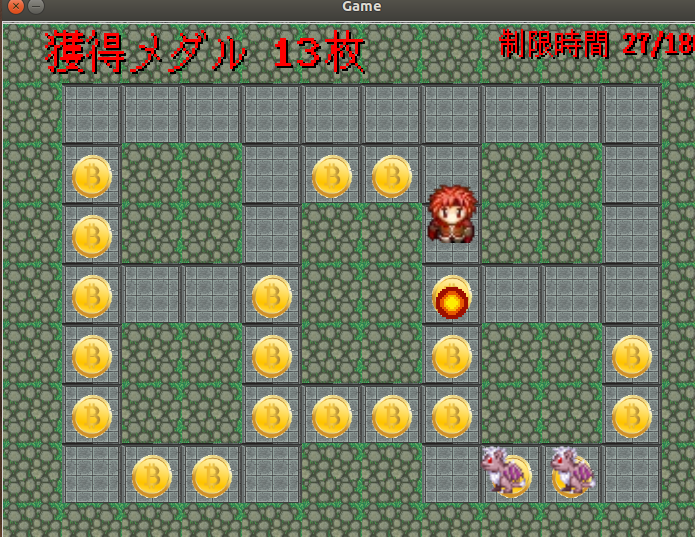
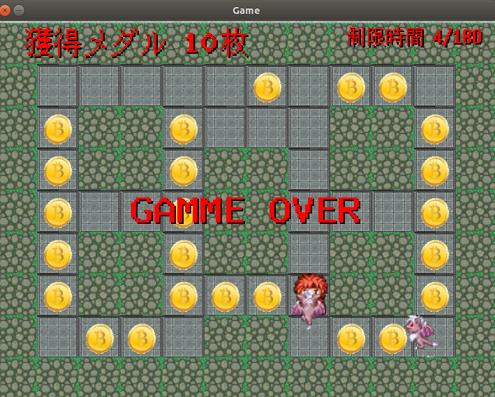
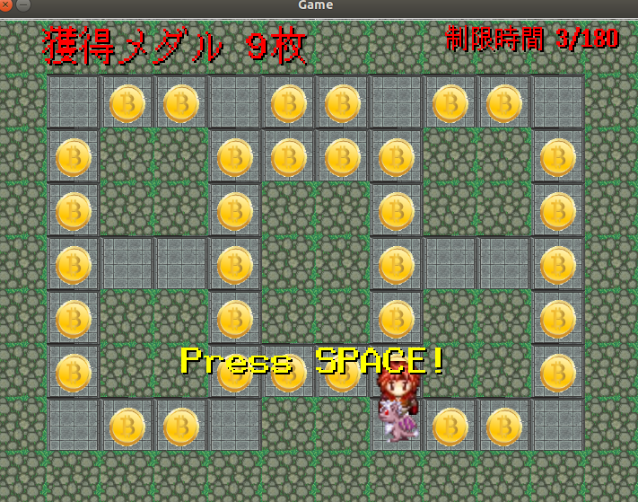
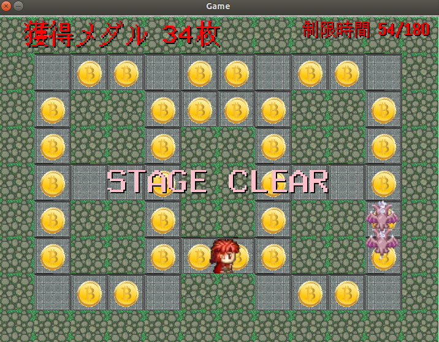

# コイン集めゲーム

ステージのコインをすべて集めるとゲームクリアです。敵にぶつかる、もしくは制限時間が過ぎてしまうとゲームオーバーとなります。また、スペースキーを押すと炎を発射し、敵を倒すことが出来ます。

#機能 
pythonのフレームワークのTkinterで制作しました。プレイヤー操作は矢印キーで行います。またスペースキーを押すと炎が噴射し、敵を倒すことが出来ます。

#実行結果

起動時は以下の画面が表示されスタートボタンを押します。

するとゲームが起動して、矢印操作でコインを拾っていきます。(コインの道を通ると拾ったことになります)

敵が近づいてきたらスペースキーを押して炎を噴射して敵を倒すことが出来ます。

敵にぶつかる、もしくは制限時間が過ぎるとゲームオーバーとなります。

しばらく待つとリトライボタンが表示され、スペースキーを押すとゲームをリトライすることが出来ます。

すべてコインを拾うとゲームクリア画面が出てきます。(ゲームクリアすると、コインがリセットされるのでコインがステージの元の位置に戻ります。)

しばらくするとリトライボタンが出てきて、リトライすることが出来ます。

#参考資料、素材

http://etolier.webcrow.jp/material/menu.html

http://yms.main.jp/page-s1/howtouse.html
